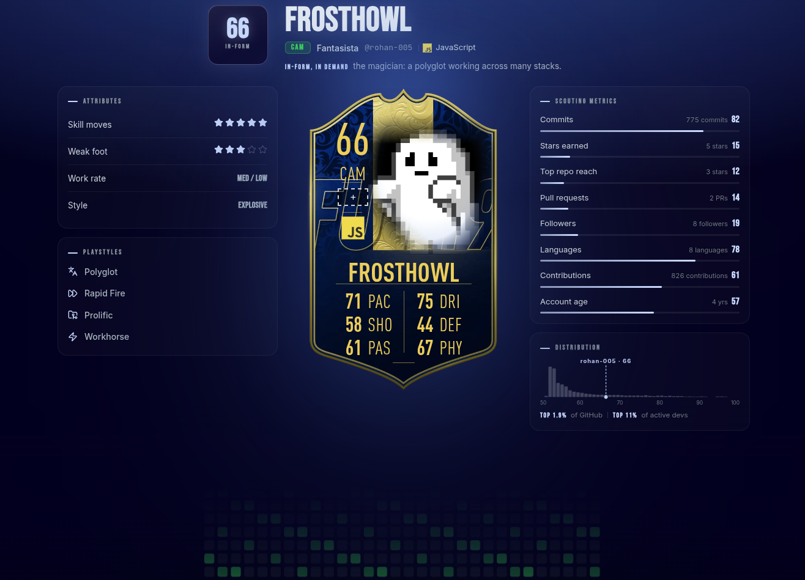
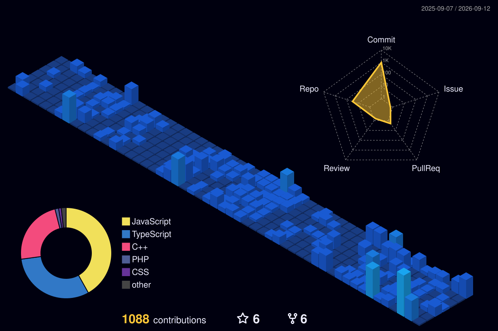

  

<h1 align="center">Hi 👋, I'm Rohan </h1>

<h3 align="center">
👾 Game Developer • 💻 Full Stack Developer • 🎮 Unity Developer
</h3>

Call Sign: <b>frosthowl ❄️</b>

Passionate about crafting immersive gameplay experiences and building scalable web applications. 
I enjoy combining creativity, problem solving, and clean architecture to build products that people love.

---

# 🚀 About Me

- 🎮 Unity Game Developer
- 💻 MERN Stack Developer
- ⚡ Next.js & React Enthusiast
- 📚 Building Coding Platforms & LMS Systems
- 🤖 Interested in AI, LLMs & Automation
- 🌱 Always learning something new

---

# 🌐 Connect With Me

---

# 💻 Tech Stack

### Languages

### Frontend

### Backend

### Game Development

### Tools

---

# 📊 GitHub Stats

---

# 🔥 GitHub Streak

---

# 📈 Contribution Graph

---

# 💻 Technologies

---

# ⚡ Current Focus

- 🎮 Unity Game Development
- 💻 Full Stack Applications
- 🤖 AI Powered Products
- 📚 LMS & Coding Platforms
- 📈 Investment Research Systems

---

